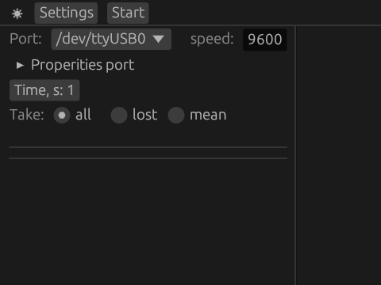
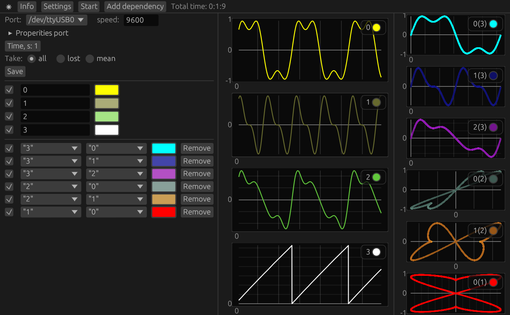

# serial-plotter

Russian version [README_RU.md](https://github.com/new99/serial-plotter/README_RU.md)

serial-plotter – a program for monitoring data from a serial port in real time. The program is written in Rust using the egui, serialport, native-dialog libraries.

## Windows version
https://github.com/new99/serial-plotter/releases

## Manual


* `Mode` changes the theme;
* `Settings` opens the settings panel;
* `Start` starts reading information;

### Settings


* `Port` selects the serial port;
* `Speed` sets the data transfer rate in bits/sec (baud);
* `Time` is the time interval responsible for data updates up to 60 seconds;
* `Take` determines how to register values: `all` records all values, `lost` records the last value, `mean` records the average value of all received values;
* `Save` saves data to a file, appears after pressing `Stop`;

### Start


* `Info` opens/closes the information panel on the left;
* `Stop` stops reading information;
* `Add dependency` adds a dependency between two values;

### panel on the right

* `Reset` resets all data;
* `Checkmark` display values;
* `Name` name of the value, can be edited;
* `Color` select the color of the value line;
* When adding dependencies:
* select two values;
* `Remove` remove the dependency;

### Interacting with graphs using a mouse
* Ability to move when holding down the left mouse button;
* Ability to move along the X axis by holding down shift and moving the mouse wheel;
* Ability to zoom in by holding down ctrl and moving the mouse wheel;
* Ability to zoom in on areas by holding down the right mouse button;
* Returns to the initial state by double-clicking the left mouse button;

## How to set up the output of information from recording devices
The program works with data read from the serial port. The received data is of the `String` type and looks like:
`"f1/r/nf2/r/n … fn/r/n/r/n"`,
where it can be divided into three parts:
* `"f1/r/n"`, `"f2/r/n"` and `"f3/r/n"` — data transmitted from the microcontroller;
* `"/r/n"` — data separation;
* `"" + "/r/n"` — signals the end of data reading (at the end we have the form `"fn/r/n/r/n"`), for working with the next line.

## Example
As an example, rrmcu work with Arduino is presented.
Let's prepare a sketch. You will need:
* `Serial.println(f1)` - the standard function for output to Arduino will be transmitted in the form `"f1/r/n"`
* `Serial.println()` - an empty line in the form `"" + "/r/n"` signals the end of data reading.

### Monitoring values
Arduino source code
```c
double x = 0;
double k = 100;
void setup() {
Serial.begin(9600);
} void loop() { double f1 = sin(x) + sin(3*x)/3;
 double f2 = sin(2*x)/2 +sin(4*x)/4;
 double f3 = 2*f1+f2;
 double ft = int(x*100)%int(2*M_PI*100);
 x += 0.01;
 Serial.println(f1, 5);
 Serial.println(f2, 5);
 Serial.println(f3, 5);
 Serial.println(ft, 5);
 Serial.println();
}
```

