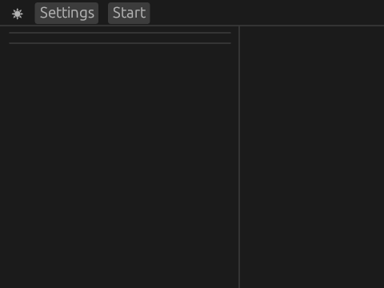
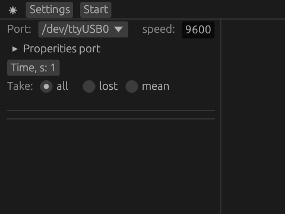
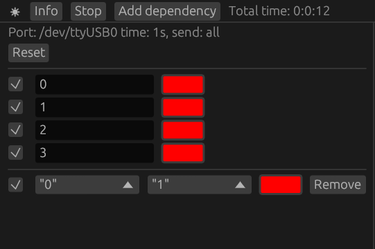
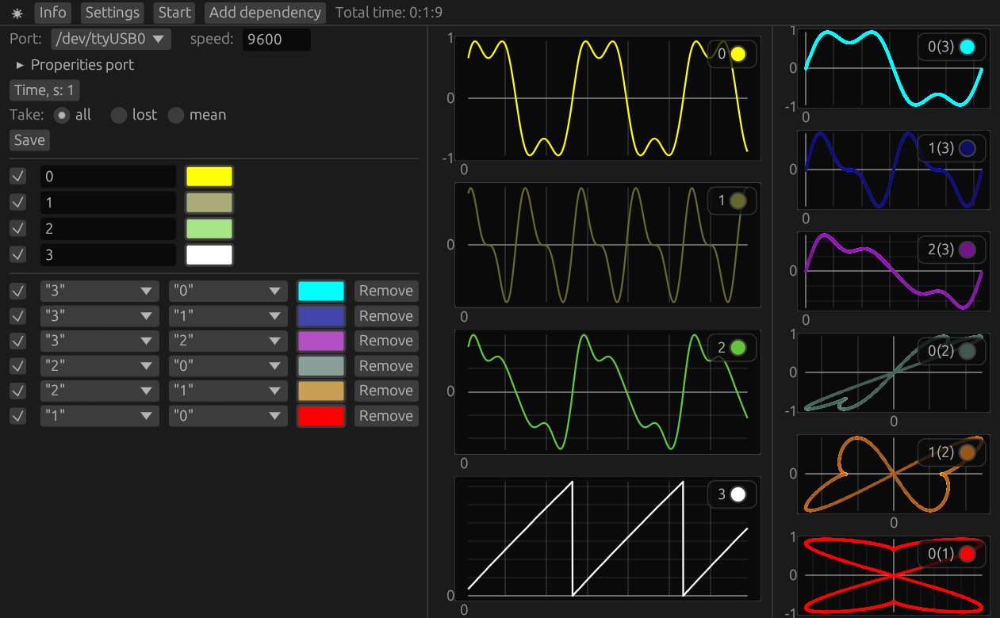

# serial-plotter

English version  [README.md](./README.md)

serial-plotter – программа для мониторинга данных с последовательного порта в реальном времени. Программа написана на Rust с использованием библиотеки egui, serialport, native-dialog.


## Версия для Windows
https://github.com/new99/Recorder_for_MCU/releases

## Инструкция


* `Mode` изменение темы;
* `Settings` открывает панель настройки;
* `Start` запускает считывание информации;

### Settings


* `Port` выбор последовательного порта;
* `Speed` задает скорость передачи данных в бит/c (бод);
* `Time` временной интервал, отвечающий за обновления данных до 60 секунд;
* `Take` отвечает каким образом регистрировать значения: `all` записывает все значения, `lost` записывает последнее значение, `mean` записывает среднее значение из всех полученых значений;
* `Save` сохраняет данные в файле, появляется после нажатия `Stop`;

### Start


* `Info` открывает/закрывает панель информации  слева;
* `Stop` останавливает считывание информации;
* `Add dependency` добавляет зависимость между двумя значениями;

### панель справа

* `Reset` обнуляет все данные;
* `Галочка` отображать значения;
* `Название` название значение, можно редактировать;
* `Цвет` выбор цвета линии значений;
* При добавления зависимостей:
  * выбор двух значений;
  * `Remove` удалить зависимость;

### Взаимодействие с графиками с помощью мыши
* Возможность передвигать при зажатие левой кнопки мыши;
* Возможность передвигать по оси X при зажатие shift и двигая колесиком мыши;
* Возможность увеличивать при зажатие ctrl и двигая колесиком мыши;
* Возможность увеличивать области при зажатие правой кнопки мыши;
* Возвращает в начальное состояние при двойном нажатие левой кнопки мыши;


## Как настроить вывод информации с регистрирующих устройств
Программа работает с данными считывающие с последовательного порта. Полученные данные имеют тип `String` и имеют вид:
`"f1/r/nf2/r/n … fn/r/n/r/n"`,
где ее можно разделить на три части:
* `"f1/r/n"`, `"f2/r/n"` и `"f3/r/n"` — данные передаваемые с микроконтроллера;
* `"/r/n"`  - разделение данных;
* `"" + "/r/n"` — сигнализирует об окончании считывания данных (в конце имеем вид `"fn/r/n/r/n"`), для работы со следующей строкой.

## Пример
В качестве примера представлена работа rrmcu с Arduino.
Подготовим скетч. Понадобится:
  * `Serial.println(f1)` - стандартная функция для вывода в Arduino передаваться будет в виде `"f1/r/n"`
  * `Serial.println()` - пустая строка в виде `"" + "/r/n"` сигнализирует об окончании считывания данных.

### Мониторинг значений
Исходный код Arduino
```c
double x = 0;
double k = 100;
void setup() {
  Serial.begin(9600);
}

void loop() {
  double f1 = sin(x) + sin(3*x)/3;
  double f2 = sin(2*x)/2 +sin(4*x)/4;
  double f3 = 2*f1+f2;
  double ft = int(x*100)%int(2*M_PI*100);
  x += 0.01;
  Serial.println(f1, 5);
  Serial.println(f2, 5);
  Serial.println(f3, 5);
  Serial.println(ft, 5);
  Serial.println();
}

```


